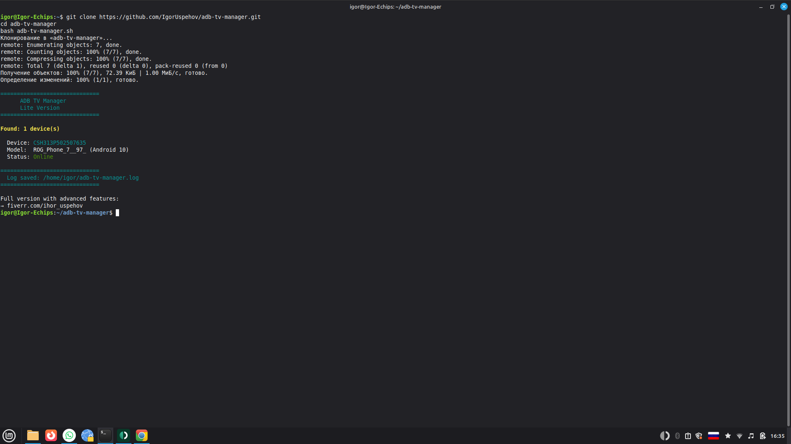

# 📺 ADB TV Manager

Professional Bash toolkit for managing multiple Android TV boxes via ADB from a Linux machine.

## Result



## What it does

- Detects all connected Android TV devices automatically
- Shows device model and Android version
- Checks internet connectivity on each device
- Session logging with timestamps
- Multi-device support (tested with 10+ boxes simultaneously)

## Example log

```
[2026-03-28 16:45:12] === SESSION START ===
[2026-03-28 16:45:13] Device: CSH313P502507635 | Tanix TX1 (Android 10) | Online
[2026-03-28 16:45:15] Device: CSH313P012603490 | Tanix TX1 (Android 10) | Online
```

## Usage

```bash
git clone https://github.com/IgorUspehov/adb-tv-manager.git
cd adb-tv-manager
chmod +x adb-tv-manager.sh
bash adb-tv-manager.sh
```

## Full Version

This repository contains the **lite version**.

Full version includes:

- Smart scheduling by day of week and time of day
- Auto WiFi login with session management (BayernWLAN / captive portal)
- URL/playlist rotation without repeats
- Advanced logging and automatic error recovery
- Parallel execution on 10+ devices simultaneously
- Auto-restart on connection loss

**→ Available on request: [fiverr.com/ihor_uspehov](https://fiverr.com/ihor_uspehov)**

## Requirements

- Linux (Debian / Ubuntu / Linux Mint)
- ADB installed (`sudo apt install adb`)
- Android TV boxes connected via USB or network ADB

## Tested on

- Linux Mint 21.3
- Tanix Android TV Box (Android 10, Allwinner H313)
- 1-10 devices simultaneously

## Compatible with

- Debian 11+
- Ubuntu 20.04+
- Linux Mint 20+

## Author

Ihor Kriazhev — [github.com/IgorUspehov](https://github.com/IgorUspehov)
AI-assisted automation | Linux | Android | ADB
